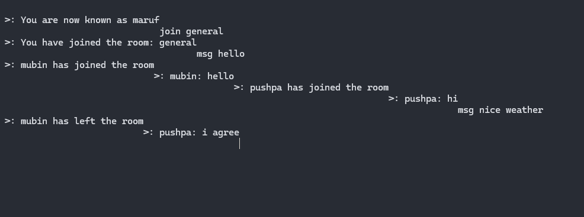
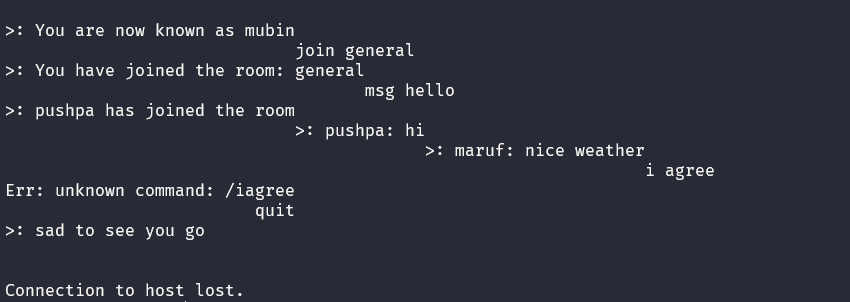
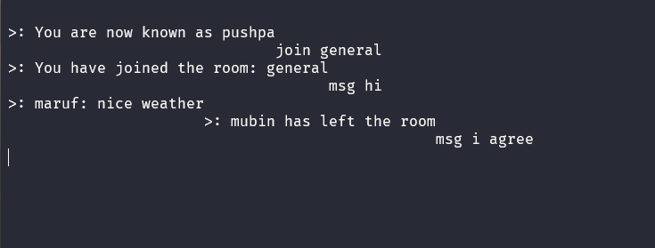

# Go TCP Chat App 🗨️
## 📸 Demo

Here’s a demo of three users chatting in separate terminals:

**User 1 Terminal**


**User 2 Terminal**


**User 3 Terminal**



A simple multi-user TCP chat application written in Go.

Users can join rooms, set nicknames, and chat with others in real-time.

---

## 💻 Features & Commands

- `/nick <name>` – Set your nickname. Otherwise, you stay anonymous.
- `/join <name>` – Join a chat room. If it doesn't exist, it will be created.
- `/rooms` – List available rooms.
- `/msg <message>` – Send a message to everyone in your current room.
- `/quit` – Disconnect from the chat server.

---
## Prerequisites:

Need Go 1.22.5+ installed
Need Telnet or Netcat for testing

## 🚀 Run the Server

```bash
go run main.go
````

Then open terminals (or clients) and connect to the server like so:

```bash
telnet localhost 8888
```

Or, if you're using netcat:

```bash
nc localhost 8080
```

---
